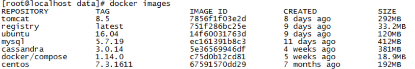

# docker安装镜像仓库

## 初始环境
&#160; &#160; &#160; &#160;系统：centos7  
&#160; &#160; &#160; &#160;内核：Linux 3.10.0-327.el7.x86_64  
&#160; &#160; &#160; &#160;docker版本：Docker version 17.06.0-ce, build 02c1d87
## 下载registry:2.6.2镜像
```
docker pull registry:2.6.2
```
## 创建SSL密钥并添加CA证书到docker内
&#160; &#160; &#160; &#160;可将如下内容添加到脚本中运行，需要注意docker run时registry的版本使用刚才pull的registry镜像的版本，若已经购买证书则直接替换/etc/docker/certs.d目录下地址文件夹内的ca.crt即可
```
#!/bin/sh
#前提条件系统安装了openssl-devel包：
#设置变量名
domain=registry_name
#创建SSL相关目录：
mkdir ~/certs
#生成SSL密钥：
openssl req -nodes -subj "/C=CN/ST=BeiJing/L=BeiJing/CN=$domain" -newkey rsa:1024 -keyout ~/certs/$domain.key -out ~/certs/$domain.csr

openssl x509 -req -days 3650 -in ~/certs/$domain.csr -signkey ~/certs/$domain.key -out ~/certs/$domain.crt

#运行容器：
docker run -d -p 5000:5000 --restart=always --name registry -v ~/certs:/certs -e REGISTRY_HTTP_TLS_CERTIFICATE=/certs/$domain.crt -e REGISTRY_HTTP_TLS_KEY=/certs/$domain.key registry:2.6.2

#添加ca证书到Docker 容器目录下：

mkdir -p /etc/docker/certs.d/$domain:5000
cp ~/certs/$domain.crt /etc/docker/certs.d/$domain:5000/ca.crt
```
## /etc/hosts文件添加registry_name的ip映射
```
192.168.137.130  registry_name
```
## 提交本地镜像到镜像仓库
&#160; &#160; &#160; &#160;  
```
#添加标签到远程链接
docker tag centos:7.3.1611 registry_name:5000/centos
#提交镜像
docker push registry_name:5000/centos
```
## linux客户端pull远端镜像
1. hosts文件中添加仓库名称和ip的映射
```
192.168.137.130  registry_name
```
2. 创建ca证书目录
```
mkdir /etc/docker/certs.d/registry_name
```
3. 添加服务端对应目录下的ca.crt文件  
4. pull远端仓库镜像
```
docker pull registry_name:5000/centos
```
